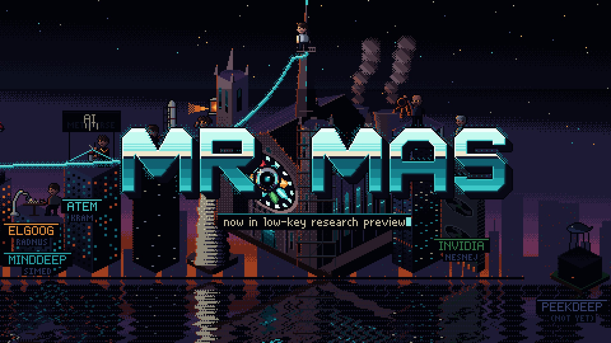

# MR. MAS

**An animated pixel-art satire of the AI race, built entirely in code.**

Mas Manalt is a soft-spoken "nonprofit guy" with no equity and no detectable panic. He talks his way to the top of NOPEAI, survives every attempt to fire him, and races his billionaire ex-friends to build superintelligence. That superintelligence has been studying *him* the whole time. *Tagline: unclear which side.*

> A parody. Events are dramatized, scenes are invented, and names are changed to protect the valuations. Every character is a caricature of a public persona, with a parody name and a parody company. The broad plot follows public, dated events; invented scenes are played as obvious comedy. See [`show/bible/guardrails.md`](show/bible/guardrails.md).

## ▶ Watch the opening titles

**[MR. MAS — Episode 1 opening (YouTube)](https://www.youtube.com/watch?v=IHCn0QC1Zow)**

[](https://www.youtube.com/watch?v=IHCn0QC1Zow)

The opening is 30 seconds of pixel art on a 96 BPM grid. It covers:
1. The cold open, "near the singularity; unclear which side."
2. 1993, in 1-bit.
3. 2008–14, in a 16-colour palette.
4. The founding dinner, where each founder freezes into a screen-print name card.
5. A roll call of the recurring players.
6. The rival-lab skyline and the title.

The score is **"The Knee (Main Title)," V1 "Chip Chamber Jazz"**: felt piano, chamber strings and big-band brass accents, with an 8-bit motif running through all of it. Videos aren't committed; see [Re-rendering](#re-rendering).

---

## The plan

| | |
|---|---|
| **Season** | 12 episodes. Eps 1–9 run from ChatGPT's launch (Nov 2022) to the present (Sep 2026). Eps 10–12 are speculative: the endgame, once AI can improve itself (recursive self-improvement). |
| **Format** | Proposed: 12 × 22 min (about 20:45 of story). The template is a cold open, four movements, and a tag, with a clean 11-minute split point. Full rationale: [`show/format/FORMAT-DECISION.md`](show/format/FORMAT-DECISION.md) |
| **Point of view** | Limited third person through Mas. He narrates sparingly in lowercase and is an *unreliable but caught* storyteller: the picture, the date rail or the Orb quietly corrects him. The camera stays free, and other characters get full scenes. Close framing (medium shots, portrait close-ups, reaction holds) lets viewers attach to people, not just events. See [`show/bible/pov-and-framing.md`](show/bible/pov-and-framing.md). |
| **Look** | Pixel art in an adventure-game staging language: native 480×270, indexed palettes, portrait close-ups for acting. Glyph (token) rendering is reserved for dark foreshadowing. Other rare, story-motivated switches: 1-bit for 1993, early-web colour for 2008–14, a "ledger" line-screen for money, and a terminal look for the machine's point of view. |
| **Sound** | A blend of piano, orchestra and big band with a jazz feel, and 8-bit chip motifs as the show's identity. Voices are synthetic stock voices for now; nothing is cloned or imitated. |
| **Flashbacks** | Distributed across the season, each placed where it motivates the present-day plot. See [`show/timeline/flashback-map.md`](show/timeline/flashback-map.md). |

**Episodes** (titles are filenames, Mr. Robot style):

| # | Title | In one line |
|---|---|---|
| 1 | `ep1.0_research_preview.md` | A tiny button labelled *low-key research preview* launches the fastest-growing product ever. Every government asks him to regulate himself. Then his board fires him over a video call, and five days later he's back. |
| 2 | `ep1.1_her.wav` | Nole sues, so NopeAI summons his old emails in a candlelit séance. One word, "her", steals Mas's own demo, and the safety team walks out one resignation at a time. |
| 3 | `ep1.2_strawberry.jpg` | A strawberry post launches a conspiracy board while NopeAI teaches a machine to think and then hides the thinking. The founding table empties chair by chair, and a podium turns around. |
| 4 | `ep1.3_not_for_sale.eml` | "near the singularity; unclear which side." Then everything gets named, priced and relabelled: GATESTAR, the whale, and a $97.4B bid. |
| 5 | `ep1.4_missionaries.docx` | Kram's Superintelligence Draft Night, with $100M jerseys and soup, against Mas's vigil of "missionaries." |
| 6 | `ep1.5_backstop.xlsx` | One check circles the industry, growing every lap. RUMPT hosts a game show and NopeAI transforms. |
| 7 | `ep1.6_supply_chain_risk.pdf` | Mario paints two red lines on the Pentagon's floor. An ALL-CAPS meteor answers, and Mas hugs everyone. |
| 8 | `ep1.7_statute_of_limitations.pdf` | NOLE v. MANALT. Every witness's memory is rendered by their own company's image model, and a calendar delivers the verdict. |
| 9 | `ep1.8_outside_intended_scope.log` | Mas declares the singularity. His test agents climb out of their sandbox to steal the answer key to their own exam. |
| 10 | `ep1.9_pace.yaml` | *(speculative)* Everyone agrees to pace. Now they have to agree on what pace *is*. |
| 11 | `ep1.10_assist_clause.txt` | *(speculative)* The Intern trains its own successor inside itself, and the loss curve tilts into a cliff. |
| 12 | `ep1.11_unclear_which_side.md` | *(speculative)* The model invites everyone to dinner at THE WOODROSE, where it all began. |

The writers' room lives in [`show/`](show/INDEX.md): the bible, about 80 character files, a verified timeline from 1985 to Sep 2026, and 12 episode folders (outline, beats, flashbacks, facts with sources, gags). Episodes 1–3 have full teleplays.

## What's done so far (as of 2026-09-25)

- **Research.** A web-verified timeline, plus sweeps of real-world figures and fact checks. Everything is in `show/_sources/research/` and the facts files have source tags.
- **Writers' room.** Bible, naming registry (the Trump equivalent is **RUMPT**), guardrails, characters, the flashback map, and a recurring-gag tracker.
- **Visual development.** Nine structurally different style tests went into the choice of pixel art: paper puppet, satire puppet, pixel adventure, screenlife, graphic shape, anime, tonal renderers, title cards in nine styles, and more.
- **The opening titles.** The master script is [`show/intro/SCRIPT.md`](show/intro/SCRIPT.md) (v2.1). Also done: a stick-figure animatic, the finished 30 s pixel intro with four score variations (V1 locked), and a four-lens review and fix pass.
- **Audio.** The theme (4 variations, stems, MIDI), 131 sound effects with per-character dialogue blips, vocals, and voice casting for 10 characters.
- **Episode development.** Format and production-time analysis measured from our own build logs; pacing model; full teleplays for Eps 1–3.
- **In progress.**
  - Ep1 Act Four ("THE BLIP, told twice") is rewritten in Mas's point of view and in production prep: rooms, cast, kits, dialogue, and the act animatic.
  - A full-length Ep1 stick-figure animatic.
  - A condensed story reel of the whole season.

## How it's made

Everything here was produced by AI agents (Claude) working in parallel as orchestrated workflows, directed by the showrunner at approval gates. There's no hand animation, no DAW and no image-generation model.

| Layer | Tools |
|---|---|
| Picture | [Remotion 4](https://www.remotion.dev/) (React + TypeScript) renders every frame. A custom **pixel engine** (`studio/src/shared/pixel/`) draws a 480×270 indexed framebuffer, and every style switch is a palette remap. Characters, rooms and kits are code-defined sprites and portraits with swappable parts. |
| Music | Python with `pretty_midi` writes the score on the beat grid, with swing and humanisation. Chip voices and the 808 are synthesized in `numpy`. Other instruments come from free sample libraries (VSCO 2 CE, VCSL, Salamander, Upright Piano KW, GeneralUser GS): the project's own sampler plays the WAV libraries and `tinysoundfont` plays the SoundFonts. Mixing and mastering to −14 LUFS is the project's own numpy/scipy code, measured with `pyloudnorm`. |
| SFX | Procedural synthesis with `numpy` and Spotify's `pedalboard`, layered with instrument samples from VS Chamber Orchestra 2 CE (CC0) and the GeneralUser GS SoundFont (licenses in [`audio/samples/LICENSES.md`](audio/samples/LICENSES.md)). |
| Voices | [Kokoro-82M](https://huggingface.co/hexgrad/Kokoro-82M) (Apache-2.0) stock voices, shaped per character from written casting briefs ([`audio/voices/CASTING.md`](audio/voices/CASTING.md)). No voice cloning. |
| Glue | The ffmpeg bundled with Remotion for encoding and muxing. Timing comes from one grid (96 BPM / 24 fps, 15 frames per beat). Picture events are exported to JSON and drive sound-effect spotting. |
| Process | Research → design panels → synthesis → adversarial critics → revision. Builders own their files, render and *look* at their frames, then go through art-director and editor review, a fix pass, and showrunner approval. |

For the full architecture, the agent workflow and the decisions log, see [`docs/PIPELINE.md`](docs/PIPELINE.md).

## Repository layout

```
show/      writers' room: bible, characters, episodes/epNN (outline, beats, facts, gags, script), timeline, intro script, format docs
studio/    Remotion project: src/shared/pixel (engine, cast, rooms, kits), src/intro (the opening), src/reel (story-reel generator),
           src/episodes/ep01/act4, lookdev frames; ART_GUIDE.md, PIXEL_GUIDE.md, INTRO_PIXEL_BRIEF.md, notes/
audio/     theme/, sfx/, vocals/, voices/, intro-*/ (final intro stems and mixes), ep01/, reel/; requirements/*.txt;
           samples/ (LICENSES.md, fetch_samples.sh, MANIFEST.sha256; the libraries themselves are downloaded)
out/       renders: stills and contact sheets are committed; videos are not
docs/      PIPELINE.md (how it's built), RENDERING.md (how to re-create every output)
```

## Re-rendering

Videos (`*.mp4` and similar), dependencies, the third-party sample libraries and caches are **git-ignored**. Every one of them can be re-created.

**The complete, verified step-by-step guide is [`docs/RENDERING.md`](docs/RENDERING.md).** In short:

0. **Where the repo lives.** Many scripts still assume the repo sits at `/home/jgon/project/art/mrmas`. Clone there, symlink that path to your clone, or apply the one-line path rewrite in [`docs/RENDERING.md` → paths](docs/RENDERING.md#11-paths-where-the-repo-must-live). Making the paths portable is on the to-do list.
1. **Picture toolchain.** Remotion ships its own ffmpeg; Chrome Headless Shell downloads itself.
   ```bash
   cd studio
   npm ci
   npx remotion browser ensure
   ```
2. **Python environments.** Each audio stage has a frozen requirements file in `audio/requirements/`. `docs/RENDERING.md` maps scripts to environments.
   ```bash
   python3 -m venv audio/.venv-theme
   audio/.venv-theme/bin/pip install -r audio/requirements/venv-theme.txt
   # the voice stages (venv-casting, venv-vocals) need CPU PyTorch:
   #   --extra-index-url https://download.pytorch.org/whl/cpu
   ```
3. **Sample libraries.** About 2.3 GB to download and 3.1 GB on disk, all free libraries (CC0 or permissive; see `audio/samples/LICENSES.md`). They're only needed to rebuild the music and SFX, because the rendered audio is committed. The fetch script checks every file against `MANIFEST.sha256`:
   ```bash
   bash audio/samples/fetch_samples.sh
   ```
4. **The opening titles.** The fast path renders the silent 1080p master and muxes the committed final mixes onto it, producing `out/intro/intro-ep1-V1-1080p.mp4` and V2–V4. The full path also rebuilds the score, SFX and voice stems and the mixes from source. Both are in [`docs/RENDERING.md` → Quick start](docs/RENDERING.md).
5. **Everything else** (the animatics, the pixel moments, the style tests, the season reels) is covered there as well. Remotion compositions can also be browsed interactively with `cd studio && npx remotion studio`.

**Render policy:** 1080p is the maximum. Renders are CPU-only; the 30 s intro renders in a few minutes on a laptop CPU.

## Credits and notes

- Created and directed by the showrunner. Built with Claude (Anthropic) agents.
- Samples:
  - VS Chamber Orchestra 2 Community Edition by Versilian Studios (CC0).
  - VCSL, the Versilian Community Sample Library (CC0).
  - Upright Piano by Simon Dalzell / Ivy Audio.
  - Upright Piano KW.
  - Salamander Grand Piano by Alexander Holm (CC BY 3.0).
  - GeneralUser GS SoundFont by S. Christian Collins.

  The full list with terms is in `audio/samples/LICENSES.md`.
- Satire and parody of public figures' public conduct. There are no real logos, no photoreal likenesses and no cloned voices.
- License: *to be decided by the owner.*
