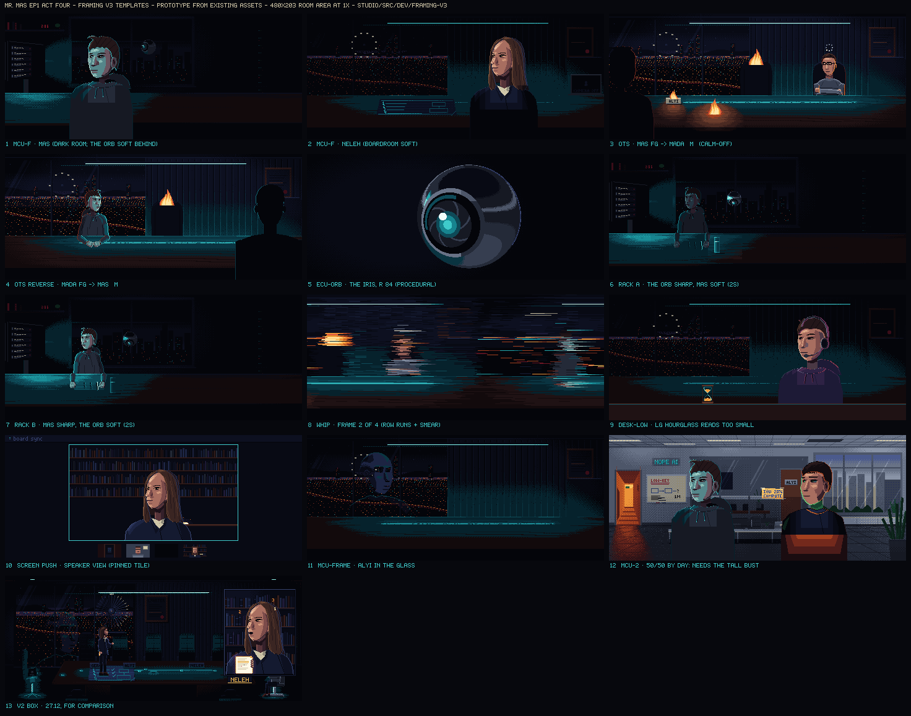

# Ep1 · Act Four · Framing v3 (cinematography)

*CINEMATOGRAPHY / FRAMING DESIGNER, 2026-09-25. Written to the showrunner's note on the Act Four animatic v2 (below), with the earlier notes standing: a thriller drama that plays fluid and never clunky ([tone-and-dialogue](../../../../bible/tone-and-dialogue.md)), no climax announced before it happens, and limited third person through Mas ([pov-and-framing](../../../../bible/pov-and-framing.md), [pov-clarification](../../../../bible/pov-clarification.md)). The grammar is the bible's new [§4.7 Shot variety](../../../../bible/pov-and-framing.md#47-shot-variety-2026-09-25); this file is its worked example on draft 3.1. The machine copy is [framing-v3.json](framing-v3.json): if the two disagree, the JSON wins. The templates are prototyped from existing assets in `studio/src/dev/framing-v3/templates.ts`, with a contact sheet at `out/ep01/act4/framing-v3/framing-v3-templates.png`.*

> **The showrunner (binding):** "why is there so much empty silence in the animatic? the dialogue feels slow. i like the visuals otherwise. don't lengthen things out just for the sake of it. also, we don't need to have all scenes in the form of boxes for people talking, we can have more closeup or other angle zoom variety shots."

**What this file decides:** every shot's size, angle, template, camera move and caption treatment, for the v3 board and the v3 animatic.

**What it doesn't decide:**
- **Lengths.** THE EDITOR's v3 lock does the dead-air pass. The frames in the JSON are carried from lock v2 (split where a v2 shot splits) only so the shares compare like for like. They are not the v3 clock. §5 gives THE EDITOR what the framing needs from each silence, and the shortest length each set-piece's coverage still works at.
- **Lines.** Those are the writer's.
- **Score and effects.** Those belong to the OST and SFX owners. v2 had only the dialogue track, so its set-pieces played as dead air.

**Contents:** [0. What v2 did](#0-what-v2-did-measured) · [1. The grammar in ten lines](#1-the-grammar-in-ten-lines) · [2. The templates](#2-the-templates) · [3. The shot plan](#3-the-shot-plan) · [4. Checks](#4-checks) · [5. The silences](#5-the-silences-what-the-framing-puts-in-them) · [6. Build list and cost](#6-build-list-and-cost) · [7. Rulings and handoffs](#7-rulings-and-handoffs)

---

## 0. What v2 did, measured

From [shots-locked-v2.json](shots-locked-v2.json), 139 shots, 453.75 s:

| | v2 | v3 plan |
|---|---|---|
| Boxed portrait windows (`[P]` `[P2]` `[PF]`) | **42 shots · 123.8 s · 27.3%** | **1 shot (the deliberate doorway `[P2]`) · 2.2%** |
| Spoken lines played in a box | **29 of 45** | **1** (Alyi's post, read from the doorway) |
| Runs of 3 or more shots of one size | **7**: THE PLAN's 7 boards; 26.04b–26.05; 27.01–27.02; 27.05–27.05c; 27.12–27.12d (5 boxes); 29.14–29.17; 30.04–30.07 (4 wides) | **0** |
| Frameless close-ups (`[MCU]`, the 50/50, frame-in-frame, desk-level) | 0 | 38 shots · 22.6% |
| Over-the-shoulders | 0 | 3 |
| Angle plates (`[HIGH]` overheads, `[LOW]`) | 0 as such (4 table inserts) | 8 (5 table overheads, the floor, 2 lows) |
| The Orb's face | a portrait window with the medium Orb inside (no Orb portrait exists) | its iris full frame, 3 shots |
| Camera moves | window opens (3 held steps) | 2 whips, 4 racks, 2 drifts, 1 pan, 1 screen macro, and the app's own pushes (the speaker view, the two-up, the half-frame tiles) |
| Shots | 139 | 147 |
| Faces and hands (§4.2) | 49.7% | 52.2% (AMBER; ruling 5 stands) |
| `[W]` | 11.5% | 12.0% |

**Why v2 read slow, from the picture's side:**
- **The box made padding.** A window opens in 3 held steps, the line types into a box, and a held room behind it gives the edit nothing to cut to. So shots were sized as lead + line + tail + the next window's opening, rather than cut on the turn.
- **Five boxes in a row** (27.12–27.12d) is one camera position for a whole argument.
- **The set-pieces had nothing to cut to** and no score under them. THE PLAN, phrases 1–3 of the falling tile and the avalanche together are ≈ 2 minutes of the 5 minutes of silence.

---

## 1. The grammar in ten lines

The rules live in [pov-and-framing §4.7](../../../../bible/pov-and-framing.md#47-shot-variety-2026-09-25). In short:

1. **Frameless first.** The default close shot is `[MCU]`: the approved portrait composed straight into the frame, no window. The room behind is stepped down 2 rungs (soft focus), and the bust is extended to the frame's bottom edge and falls off to shadow.
2. **Three setups, not two.** Place the pair in a two-shot, then alternate `[MCU]` singles with an `[OTS]` or a screen, so the size changes on every turn. Return to the two-shot for the button.
3. **No more than 2 consecutive shots of the same size.** The board runs the check (§4).
4. **A new setup on every change of speaker.** A two-shot may carry one question-and-answer pair when the relation in the frame is the joke.
5. **Angles are drawn, never faked.**
   - Overheads of a table or a floor, and lows on architecture, are pre-drawn plates.
   - Pushes are cut-ins up the ladder.
   - The only zoom is a screen's own (the app's speaker view, the screen macro).
6. **Moves stay on the whole-pixel grid:** whip (4 f), rack (3 held steps), drift (≤ 16 px), pan (across oversize art). None of them touches the record: real lines, posts and cards play in a still frame, and record text is never soft.
7. **The box is in-world** (call tiles, phones, monitors, the security camera; name cards are show chrome) **or deliberate** (≤ 2 per act; Act Four uses 1).
8. **No typed box on close coverage** (PROPOSED, the default for the v3 animatic). The box stays on wides, on voices off picture or through a speaker, and on posts.
9. **Screen direction and POV are unchanged.**
   - Mas stays in the left third and is never flipped at portrait or `[CU]` scale. His silhouette may flip.
   - Full-bleed is his; a bezel is the world's.
   - The exit has no Mas single of any size.
10. **Cut on the turn, never pad.**
    - L-cuts ≤ 8 f.
    - ≤ 1 beat after a line's last word, unless a HOLD is scripted.
    - ≤ 4 s on one setup while people talk, unless a camera move or a staged action carries it. A real line plays whole on one still shot, however long (31.06's memo: 6 s).
    - In a set-piece, cut every ≤ 2 bars and to a face every ≤ 4 bars.

---

## 2. The templates

Each template is one layout function per shot, like `rooms/twoshots.ts`: a pure painter of the 480 × 203 room area (the rail builder owns rows 203–269). The helpers they share go into `src/shared/pixel/framing.ts`, which is additive and owned by the engine owner. The prototypes are in `studio/src/dev/framing-v3/templates.ts`; the contact-sheet panels are cited as *sheet N*.



### 2.1 Shot templates

| Template | What it is | Built from (exists) | New | Parameters | Act Four |
|---|---|---|---|---|---|
| **MCU-F** · frameless close-up (*sheet 1, 2*) | The portrait art composed into the frame, no window: eyes on the upper third, the bust bleeding off the bottom edge. The room behind is stepped down 2 rungs (soft) with negative fill around the bust. **`·PF`**: the room keeps stepping down in held steps (the old fallaway, as a lighting move). | Every principal's portrait `Img` (`masPortrait`, `masLookDown`, `nelehPortrait`, `madaPortrait`, `rimaSpeakPortrait`, `alyiSpeakPortrait`, `marioPortraitImg`, `adelinaPortrait`, `ttemmePortrait`, `tasyaSpeakPortrait`, `terbPortrait`, `gergGlow`), all with their mouths and lids, so lip-sync is v2's. The rooms and plates behind them. | The helper. At night the helper's extension reads (sheet 1, 2, 9). **By day it reads boxy (sheet 12)**, so the portraits used in day rooms need a "tall bust": the portrait's own vector torso re-rendered 48 rows longer (5–10 agent-min each; Mas, Gerg, Tasya, Alyi for Act Four) | `who, state, side ('L' at x ≈ 100: head centre on the left third; 'R' at x ≈ 262), top y 20–26, extend 48, room painter, soft k (2 at night, 1–2 by day), fallaway steps, rack target` | 32 shots |
| **MCU-2** · the frameless 50/50 (*sheet 12*) | Two frameless busts in one frame, one per third: Mas left (turned to camera-left, which can be the joke: not looking), the other right; the thing between them soft. A shared frame (§3.8) without a box; it may carry one question-and-answer pair (rule 2) | `MCU-F` ×2 | The helper; the tall busts by day | `left who, right who, between (a prop layer to rack to)` | 31.03 |
| **MCU-FRAME** · frame in frame (*sheet 11*) | `MCU-F` inside a frame the world owns: a **doorway** (the jamb and leaf as full-height foreground shapes; he can step back into its dark in whole pixels) or a **dark window** (the reflection stepped down 1 rung, the city showing through him) | `alyiReflection`, `alyiSpeakPortrait`, `tasyaSpeakPortrait`; the boardroom plate's window; the doorway shapes of `drawDoorwayP2` | The doorway jamb and leaf at full height (5–10 agent-min) | `who, frame 'door' \| 'glass', step (0..n whole px), dim` | 27.07, 27.08, 27.12c, 27.33 |
| **DESK-LOW** · desk level (*sheet 9*) | An insert-scale prop big on the frame's bottom edge, with the `MCU-F` above and behind it. The rack moves between them | `MCU-F`; props at insert scale (the glass) | **The hourglass at insert scale** (10–15 agent-min). Sheet 9 shows the `lg` one reads as a small prop on the table, not a foreground | `prop, prop x, who, rack from→to` | 27.31 |
| **OTS** · over-the-shoulder (*sheet 3, 4*) | Foreground: the listener's portrait as a silhouette (N0 plus a 1 px rim on the key side; the fires `W3`, the pendant `C3`, tungsten `W4`), bleeding off the frame's side and bottom and cut 30–45% by the edge. Background: the speaker's **medium rig** in a medium plate, in the opposite third. **OTS-W**: the background is a room wide | The medium rigs (Mas, Neleh, Mada, Gerg's tile, the Orb) and plates (dark desk, boardroom table); every portrait for the silhouette | The helper | `fg who, flip, fg x (≈ −34 left / ≈ 372 right), top y 34–40, rim, bg painter` | 27.12a, 30.15, 30.24 |
| **2S / M** | As v2 | `drawDark2S`, `drawBoard2S`, `drawCalmOff2S`, `drawMadaM` | — | as built | 13 shots |
| **CU** | As v2: one silent drawing, two backdrops | `drawMasCU` | — | backdrop | 26.05a, 30.25 |
| **ECU-HANDS / ECU-EYES / ECU-PROP** | As v2 | `kits/inserts-mas`, `inserts-hands`, `inserts-props`, `drawEyesStrip`, the rooms' inserts | — | as built | 20 shots |
| **ECU-ORB** · the iris full frame (*sheet 5*) | THE ORB at radius 60–90 on a dark pool; its look steps one target a beat (`orbStep`); toasts ride. A shot *of* the witness, never its POV | `drawOrb` (procedural, any radius), `orbStep`, `callToast` | — | `r, centre (≈ 262, 101), looks[], aperture, toast` | 26A.06, 29.10, 29.07a |
| **HIGH-TABLE** · the overhead | The boardroom table insert as the act's overhead: the blueprint, the hourglass, and now the phones walking | `drawTableInsert` 'blueprint' and 'prop' | **The 'phones' focus**: four phones at insert scale, walking to the edge in held steps (15–20 agent-min) | `focus, word, phones step` | 27.13, 27.16, 27.30, 27.36, 30.21 |
| **HIGH-FLOOR** | His eyeline down to the bullpen floor, top-down: slate tiles, his shoe tips at the top edge. The reverse of "hi." | the landlord's slate remap | **The floor plate** (10–15 agent-min) | `palette step` | 30.08b |
| **LOW-ROOM** | A pre-drawn low angle on architecture: the bullpen ceiling (the landlord's "above them"); the lobby sign looming, Mas small at the desk | the rooms' materials and the slate remap; the lobby sign | **Two plates**: the bullpen ceiling (20–30 agent-min) and the lobby low angle (25–35 agent-min) | `palette step, sign state` | 30.06, 30.22 |
| **SCREEN** (*sheet 10*) | Grids and feeds as v2, plus the app's own pushes: the **active-speaker view** (a pinned tile, automatic, never his click), the **two-up**, the **half-frame tile**, a **closer laptop**. In the exit, a bezel edge stays in frame | `kits/callgrid` (`gridLayout(n, {w, h, area})`, `drawTile`), every `draw*Tile(x, y, w, h)` | Kit parameters. **The dialog and the arrow at 2× UI scale** for the click close (5–10 agent-min) | `layout 'grid' \| 'speaker' \| '2up' \| 'half', pinned, bezel` | 30 shots |
| **SCREEN-MACRO** | An integer 2× crop of a screen's own pixels (in-world digital zoom), ≤ 1 beat, ≤ 2 per act. In the exit it keeps a bezel corner | any screen buffer | The helper | `rect, bezel corner` | 27.09b |
| **BP-SIZES** | THE PLAN in three sizes: sheet, section, detail (linework redrawn at 2× coordinates, 1 px lines), and a whole-pixel pan down a sheet drawn taller than the frame | `kits/blueprint`, the sc 25 layout (`plan25.ts`) | Kit parameters | `size, pan y(f)` | 8 shots |
| **CARD-RIDE** | A name card rides the live shot and logs as that shot. Its portrait window is show chrome, not a box | `nameCard`, `blipCard` | — | as built | 4 |
| **W** | As v2 | the rooms | — | — | 13 |
| **BOX** · the deliberate window | The approved window, used on purpose, ≤ 2 per act, its reason on the board | `drawDoorwayP2` | — | — | 30.01 |

### 2.2 Moves (helpers in `framing.ts`)

| Move | Recipe | Act Four |
|---|---|---|
| **WHIP** (*sheet 8*) | 4 frames: 2 of the outgoing shot sliding off (−60, −180 px) and 2 of the incoming arriving (+180, +60). Every room row is held in runs of `0.12 × travel` px (the stepped streak), plus the dinner scenes' highlight smear (`whipSmear`, promoted). The rail band and the UI never streak. It lands on a downbeat. | 26A.06 → 27.01 (right to left: the rewind), 30.09 → 30.10 (the door bangs) |
| **RACK** (*sheet 6, 7*) | Two layers with coverage masks (Mas's medium rig and the Orb already take a `mask`; the other rigs need the same one-line option). The soft layer steps down 2 rungs; focus moves in 3 held steps, 2 f each. It never softens record text | 27.31 (the hourglass → Ttemme), 29.10a (Mas → the Orb), 29.13 (Mas → the door), 31.03 (the two men → the vault on the hum) |
| **DRIFT** | Foreground 1 px per 4 f, background 1 px per 8 f, ≤ 16 px a shot, on held non-record shots of 3 s or more | 26A.05 (the V.O. close-up), 27.12a (the OTS onto the glass) |
| **PAN** | Whole-pixel `moveTo(..., hold = 2)` across an oversize sheet | 25.03 |
| **CUT-IN** | Consecutive cuts up the ladder on one axis | 26.04c → 26.05 → 26.05b → 26.05a (the MCU, the dialog, the drop, the CU); 30.14 → 30.15 → 30.16 (two-shot, OTS, MCU); 30.24 → 30.25 (OTS-W → CU) |
| **SCREEN PUSH** | The app changes its layout (grid → speaker view → macro) | 26.03, 27.09b |

### 2.3 Build notes the prototype taught

- **Call the portrait `Img`, not the `draw*Portrait` wrapper.** The wrappers paint a window background. Carry each portrait's extras at the new origin with their own helpers:
  - Neleh's footnote orbit (`drawFootnotes`)
  - Mada's spinner (`drawSpinner`)
  - Ttemme's chat column (`drawChatOverlay`, as his stream's own UI at the frame edge)
  - Rima's spotlight (a pool on black, full frame)
- **The shoulders are the portrait's own arms.** The torso polygons already slope and fall (`masPortraitFig` torso: 4,144 · 6,116 · 14,104 …). The window never cropped them; they just stop at row 135. The helper repeats the last row down and falls off to shadow in hard bands, and at night that reads (sheet 1, 2, 9). **By day it doesn't** (sheet 12): the flat torso reads as a block, and any detail in the last row (Gerg's print) repeats into stripes. So the day rooms need the tall-bust re-render: the same polygons, 48 rows longer, rendered on a 112 × 184 canvas.
- **Match the portrait's light to the room.** The portraits carry their own key (Mas's `light: 'monitor' | 'warm'`). Pick the one the room motivates: sheet 12's cyan Mas in a daylit bullpen is the wrong pick, and it's a pick, not a relight (§4.1).
- **Negative fill** (the room behind the lower bust stepped down 2 more, dithered because it's background) keeps the torso from reading as a cut-out against a lit desk.
- **The V.O. text band (y 182–203) lands on the bust's falloff shadow** in `MCU-F`, which is exactly where §5.2 wants it (26A.05).
- **Eyes on the upper third.** Portrait top at y 20–26 puts the eyes at y ≈ 65–80 of 203. Placing the portrait's bottom on the frame edge instead drops the eyes to 57% of the frame, which reads as a head sinking.
- **Screen direction in the exit.** In the boardroom, Neleh is frame-left facing right, as the two-shot stages her (`drawBoard2S` flips her). Her singles keep that line: flip the portrait, as `lay.ts` already does for non-Mas portraits.

---

## 3. The shot plan

One row per v3 shot, in cut order.
- **v2** is the lock-v2 shot the v3 shot comes from. A split lists the same v2 id twice; a merge lists two.
- **Template · move** names the layout (§2) and any camera move. **box** marks the shots that keep the typed dialogue box (§1 line 8): wides, voices off picture or through a speaker, and posts. Every other spoken line plays without it.
- **Why · build** gives the rule the change answers, and what the shot needs. "exists" means it's built; "helper" means a `framing.ts` helper; "NEW" means a drawing (§6).

### Sc 24 · The suite (2 bars)

Open close, earn the wide: the wide is the shiver gag, then the hand, then his face. The `[PF]` box becomes the frameless close-up, with the suite stepping down behind it.

| v3 | v2 | Framing | Template · move | In the shot | Why · build |
|---|---|---|---|---|---|
| 24.01 | 24.01 | `[W]` | W | The suite: the crane truck passes, every glass shivers but his. | exists |
| 24.02 | 24.02 | `[ECU]` | ECU-HANDS | His two fingers nudge the glass one pixel true. | exists |
| 24.03 | 24.03 | `[MCU·PF]` | MCU-F | MAS frameless, left third; the suite steps down behind him to the laptop glow; the flash-print to blueprint rides the last beat. | was [PF] box; helper |

### Sc 25 · THE PLAN (the show's voice)

No faces here: this is the show's voice, with no Mas tell. The variety comes from the sheet itself. Sheet, section and detail sizes alternate, and the structure is one pan down a sheet drawn taller than the frame. The coverage works at any length from ≈ 11 bars up (§5); the bar count is the writer's and THE EDITOR's.

| v3 | v2 | Framing | Template · move | In the shot | Why · build |
|---|---|---|---|---|---|
| 25.01 | 25.01 | `[GFX·sheet]` | BP-SIZES | THE WORD: the grid draws itself; HOW TO FIRE A CEO WHO OWNS NOTHING. stamps. | exists |
| 25.02 | 25.02 | `[GFX·section]` | BP-SIZES | THE DIAGRAM: nine chairs; DIRE, NOVIHS, DRUH walk off; LEFT EARLIER IN 2023; THESE FOUR VOTE. | exists |
| 25.03 | 25.03 | `[GFX·sheet]` | BP-SIZES · pan | The structure, plan view: a whole-pixel PAN down one oversize sheet, NONPROFIT → CONTROLS → COMPANY, the key ring outside the fence. | split; kit param (sheet taller than the frame) |
| 25.03b | 25.03 | `[GFX·detail]` | BP-SIZES | Cut-in: the CEO box, EQUITY: 0 (HIS TESTIMONY); the blueprint moth opens its wings (linework redrawn 2x, 1 px lines). | split; kit param (2x coordinates) |
| 25.04 | 25.04 | `[GFX·section]` | BP-SIZES | THE PLAN: four walkers tick 1 · 2 · 3 in stride and stop at 4. | exists |
| 25.05 | 25.05 | `[GFX·detail]` | BP-SIZES | The walkers at 2x: NELEH "Step four." / MADA "Good question." (a GFX pair: one Q+A in one frame). | exists |
| 25.06 | 25.06 | `[GFX·detail]` | BP-SIZES | The blank line: the chalk squeaks and snaps. | exists |
| 25.07 | 25.07 | `[GFX·sheet]` | BP-SIZES | The corner curls, neon bleeds through; the sheet tears on the line of step 4. | exists |
| 25.08 | 25.08 | `[ECU]` | ECU-HANDS | His hand on the trackpad; JOIN; click. | exists |

### Sc 26 · The falling tile

The suspense run.
- v2 played three screens in a row twice. v3 puts a face or his eyes between every two screens: the MCU, the eyes strip, then the MCU again while the arrow settles off screen.
- The click splits into a close on the dialog and the drop on the grid, and the run lands on the `[CU]`.
- "super." plays on his frameless face. The listener is the frozen grid, whose control bar still shows his mic lit.

| v3 | v2 | Framing | Template · move | In the shot | Why · build |
|---|---|---|---|---|---|
| 26.01 | 26.01 | `[POV·grid]` | SCREEN | His laptop: the five-tile grid connects; four vote icons already flipped (Wi-Fi 1 bar egg). | exists |
| 26.02 | 26.02 | `CARD on [POV·grid]` | CARD-RIDE | NELEH name card rides the live grid. | exists |
| 26.02a | 26.02a | `[MCU·PF]` | MCU-F | MAS frameless; the suite down to the Strip neon + laptop glow; he reads the icons, one pupil step per tile; HOLD 1 beat. | was [PF] box; helper |
| 26.03 | 26.03 | `[POV·pin]` | SCREEN · box | The app's active-speaker view (automatic, never his click) pins ALYI: his mouth moves, no sound reaches Mas; the box over his tile types … and stops. | in-world push; kit param (pinned tile) |
| 26.04 | 26.04 | `[POV·grid]` | SCREEN | The 1993-style dialog pops up over his tile: OK · Cancel (Cancel live). | exists |
| 26.04a | 26.04a | `[ECU]` | ECU-EYES | The eyes strip: his pupils move one pixel toward the dialog. | exists |
| 26.04b | 26.04b | `[POV·grid]` | SCREEN | The unlit arrow steps in from the board tiles, one tile a beat. | exists |
| 26.04c | 26.04c | `[MCU·PF]` | MCU-F | MAS, still: the laptop glow only; nothing on him moves while the arrow (O.S.) settles on Cancel. | breaks a 3-screen run; helper |
| 26.05 | 26.05 | `[POV·close]` | SCREEN | Close on the dialog: the arrow clicks Cancel on the downbeat. D6 DROP-OUT starts here. | split; NEW: dialog + arrow drawn at 2x UI scale |
| 26.05b | 26.05 | `[POV·grid]` | SCREEN | His tile drops out of the grid, four drawings, GLYPH dissolve; the four slide together. | split; exists |
| 26.05a | 26.05a | `[CU]` | CU | MAS full frame, silent (the Strip neon); HOLD 2 beats; +1 FIRING on beat 3. | exists |
| 26.06 | 26.06 | `[ECU]` | ECU-HANDS | The phone buzzes, the room sound returns; [super]×3 lights; the mic chip still lit; his thumb taps the middle one at once. | exists |
| 26.07 | 26.07 | `[MCU]` | MCU-F | MAS frameless (neon): "super." into the still-open mic. No music. | was [P] box |
| 26.08 | 26.08 | `[POV·grid]` | SCREEN | The grid as his screen shows it: four held faces (a listener's hold); the control bar's mic still lit. | exists |
| 26.09 | 26.09 | `[W]` | W | The suite: the truck passes, every glass shivers; his does not. | exists |
| 26.10 | 26.10 | `[GFX]` | GFX | The candor quote card. | exists |
| 26.11 | 26.11 | `[POV·grid]` | SCREEN | His greyed tile, still falling, becomes the render front. | exists |
| 26.12 | 26.12 | `[W]` | W | F1.2 TPOOL door, EARLY-WEB16, (REPORTED). | exists |
| 26.13 | 26.13 | `[ECU]` | ECU-PROP | The frosted glass; the dither settles into wood grain. | exists |

### Sc 26A · The dark room, that night

The Orb gets its own face: its iris full frame replaces the boxed `[P]` (there is no Orb portrait). The rewind leaves on a right-to-left whip, the one whip in the act that means time.

| v3 | v2 | Framing | Template · move | In the shot | Why · build |
|---|---|---|---|---|---|
| 26A.01 | 26A.01 | `[ECU]` | ECU-HANDS | He carves mark 3, brushes the shavings, thumb on mark 3 only. V.O. "i don't keep score." (bar 2). | exists |
| 26A.02 | 26A.02 | `[2S]` | 2S | Mas + the Orb: its iris counts 1, 2, 3 and stops on his thumb. | exists |
| 26A.03 | 26A.03 | `[POV]` | SCREEN | His phone, full-bleed: the post types in source casing, 9:32 PM PT. | exists |
| 26A.04 | 26A.04 | `[ECU]` | ECU-PROP | The Senate wallet, HEALTH INSURANCE; a moth flies out. | exists |
| 26A.05 | 26A.05 | `[MCU·PF]` | MCU-F · drift | MAS frameless; the room down to the cyan key + rack LEDs; V.O. "the meeting ended early." on the hoodie shadow. | was [PF] box; helper |
| 26A.06 | 26A.06 | `[ECU·Orb]` | ECU-ORB · whip-out | The Orb's iris, full frame, lifts from the desk to his face; toast rewinding…; WHIP (right→left) into pass one. | was [P] box (no Orb portrait exists); procedural |

### Sc 27 · Pass one: the board's side (the exit)

The exit. Everyone gets close coverage; Mas gets none (his voice on their speaker, his posts, the security tile). Screens keep their bezels.
- **The calls** alternate a person's own world, full frame (`[MCU]`), with the app's views (grid, two-up), so the size changes on every turn.
- **The boardroom volley** uses three setups. The two-shot places Neleh, Mada and the reflection. Neleh's singles alternate with Alyi, first over her shoulder onto the glass, then in the glass itself. The phones walk in an overhead.
- **The lighthouse** gets its one wide, for the phone-taking.
- **The windows' jokes move into the world:** Alyi backs into a real doorway, and Tasya stands in the door the wall grew.

| v3 | v2 | Framing | Template · move | In the shot | Why · build |
|---|---|---|---|---|---|
| 27.01 | 27.01 | `[SCR·grid]` | SCREEN · box (speaker) | The board's grid on a laptop, bezel: the call goes on; his "super." out of the small speaker (no portrait). | exists |
| 27.01a | 27.01a | `[MCU]` | MCU-F | NELEH at her own desk (her tile's world, full frame): she turns a page and doesn't look up. The catch lands on a face. | split; nobody looked up; helper + nelehTileBg at 480x203 |
| 27.01b | 27.01a | `[SCR·grid]` | SCREEN | Toast GERG MOCKBRAN has left.; his post "…I quit." green-lit. | split; exists |
| 27.02 | 27.02 | `[SCR·close]` | SCREEN | Closer on the laptop: BUKAJ has left.; keycaps rain across the tiles. | kit param (bigger tiles, bezel edge) |
| 27.03 | 27.03, 27.04 | `[MCU] + CARD` | MCU-F | RIMA in her hard spotlight, smoothing her jacket; RIMA TAMURI name card rides. | was [P] box; helper + spotlight pool |
| 27.05 | 27.05 | `[SCR·2-up]` | SCREEN | The call's two-up (bezel): RIMA "I'll hold it together." in her tile, NELEH listening in hers. | was [P] box; kit param (2-up layout) |
| 27.05a | 27.05a | `[MCU]` | MCU-F | NELEH (her desk): "For how long?" | was [P] box |
| 27.05b | 27.05b | `[MCU]` | MCU-F | RIMA (pleasant): "We'll share more soon." | was [P] box |
| 27.05c | 27.05c | `[SCR·2-up]` | SCREEN | The two-up: NELEH, one brow up. | was [P] box |
| 27.06 | 27.06 | `[W]` | W · box | The bullpen all-hands: one hand up in the tiled crowd; "Is this a coup?" (box with a tail). | exists |
| 27.07 | 27.07 | `[MCU·door]` | MCU-FRAME | ALYI frameless in the doorway, the jamb and leaf cutting him: "You can call it this way" [V]. No move. | was [P] box; helper + full-height jamb/leaf |
| 27.07a | 27.07a | `[W]` | W | The crowd: the one hand is still up (the listener). | exists |
| 27.08 | 27.08 | `[MCU·door]` | MCU-FRAME | ALYI steps back into the dark of the doorway, one whole-pixel step a time, until the frame has all of him; the empty doorway holds 1 beat. | was "steps out of his own window" |
| 27.09 | 27.09 | `[SCR·grid]` | SCREEN | NOV 18: a heart, ten, hundreds pour over the grid. | split; exists |
| 27.09b | 27.09 | `[SCR·macro 2x]` | SCREEN-MACRO | Screen macro (integer 2x of the screen's own pixels, the bezel corner kept in frame: the world's view): the one blue heart lands on Mada's spinner and spins with it. | split; macro 1 of 2; helper |
| 27.10 | 27.10 | `[SCR·grid]` | SCREEN | His post "…eulogy" scrolls across the hearts. | exists |
| 27.11 | 27.11 | `[2S]` | 2S | Boardroom, night: NELEH (marker) + MADA (spinner), ALYI a reflection in the window between them; every phone buzzes. | exists |
| 27.12 | 27.12 | `[MCU]` | MCU-F | NELEH frameless, left third, facing right (flipped): "The bylaws allow it. Footnote three." | was [P] box |
| 27.12a | 27.12a | `[OTS]` | OTS · drift | Over NELEH's shoulder onto the window: ALYI's reflection "Step four… will reveal itself." | was [P] box; helper |
| 27.12b | 27.12b | `[2S]` | 2S | NELEH: "When?" (Mada unmoved, the reflection between them). | was [P] box |
| 27.12c | 27.12c | `[MCU·glass]` | MCU-FRAME | ALYI's reflection close in the dark glass, the Valley's lights through him: "The company will tell us." | was [P] box; helper (reflection stepped -1) |
| 27.12d | 27.12d | `[MCU]` | MCU-F | NELEH listening, one brow up. | was [P] box |
| 27.13 | 27.13 | `[HIGH]` | HIGH-TABLE | Overhead on the walnut: every phone buzzes harder and walks toward the edge, one held step a beat. | NEW: drawTableInsert "phones" focus |
| 27.14 | 27.14 | `[MCU]` | MCU-F | NELEH: "The company is calling us." | was [P] box |
| 27.14a | 27.14a, 27.14b | `[2S]` | 2S | ALYI's reflection between them: "That is the company telling us." It flickers for two frames and steadies; the black tile never moves. | was [P] box + 2S merged (-30 f: the flicker rides the line's tail) |
| 27.15 | 27.15 | `[MCU·PF]` | MCU-F | NELEH looks down at the blank line; the boardroom steps down behind her. HOLD 1 beat. Her real face. | was [PF] box |
| 27.16 | 27.16 | `[HIGH]` | HIGH-TABLE | Her hand uncaps the marker and writes ? on the blank line. | exists |
| 27.17 | 27.17 | `[W]` | W | The whole table: the speakerphone dials four tones. CUT on the first ring. | exists |
| 27.18 | 27.18 | `[ECU]` | ECU-PROP | Lighthouse: the phone with the little throne rings. Rail (REPORTED). | exists |
| 27.19 | 27.19 | `[MCU]` | MCU-F | MARIO, the lamp turning in the window behind: "I've written up some thoughts." | was [P] box |
| 27.20 | 27.20, 27.21 | `[W] + CARD` | W | The lighthouse: ADELINA crosses and takes the phone out of his hand; her name card rides. | was [P2] box; exists (room sprites) |
| 27.22 | 27.22 | `[MCU]` | MCU-F | ADELINA, into the phone: "In plain English: no." | was [P2] box |
| 27.23 | 27.23 | `[ECU]` | ECU-PROP | Click. The throne falls off the handset. | exists |
| 27.24 | 27.24 | `[MCU]` | MCU-F | MARIO answers the second phone; the rent meters spin SHARP in the window behind (record text never goes soft): "Hi. Yes. We're very worried. How much?" | was [P] box |
| 27.26 | 27.26 | `[SCR·cam]` | SCREEN | The lobby security-camera tile, bezel, grainy: a figure in a GUEST lanyard; his post upside-down in the corner. | exists |
| 27.27 | 27.27 | `[W]` | W | Boardroom, Nov 19: the spotlight swings off Rima's empty chair onto TTEMME. | exists |
| 27.28 | 27.28 | `CARD on [W]` | CARD-RIDE | TTEMME name card rides the wide. | exists |
| 27.29 | 27.29 | `[MCU]` | MCU-F | TTEMME (headset, hourglass; his stream chat scrolling up the frame edge): "Chat. I'm the CEO now." | was [P] box |
| 27.30 | 27.30 | `[HIGH]` | HIGH-TABLE | He sets the hourglass down and flips it: three drawings. | exists |
| 27.31 | 27.31 | `[LOW·desk]` | DESK-LOW · rack | Desk level: the hourglass big in the foreground, sand falling; TTEMME above it watching: "Chat… for how long?" | was [P] box; NEW: the hourglass at insert scale (the lg one reads too small in the foreground: sheet panel 9) |
| 27.32 | 27.32 | `[2S]` | 2S | NELEH + MADA: the wall steps to slate; a door appears and opens. Hard cut to the door (no whip: her real line starts 6 f into 27.33). | exists |
| 27.33 | 27.33 | `[MCU·door]` | MCU-FRAME | TASYA in the new doorway, slate light, the sign pointing out: "a new advanced AI research team" [V]. No move. | was [P] box |
| 27.35 | 27.35 | `[2S]` | 2S | NELEH + MADA look down at the blueprint (the listeners). | exists |
| 27.36 | 27.36 | `[HIGH]` | HIGH-TABLE · box (O.S.) | Overhead: step 4 blank but for her ?. NELEH (O.S.): "Step four?" | split; exists |
| 27.36b | 27.36 | `[MCU]` | MCU-F | MADA, the spinner turning: "Good question." Pass one ends on his face. | split |

### Sc 28 · The act-out card

Unchanged.

| v3 | v2 | Framing | Template · move | In the shot | Why · build |
|---|---|---|---|---|---|
| 28.01 | 28.01 | `[GFX]` | GFX | WHAT THEY DIDN'T KNOW. | exists |

### Sc 29 · Pass two: his side

Back through the glass.
- The Orb's two looks become its iris, full frame. "mostly." plays on his face with the Orb soft behind him, and a rack onto it.
- The Gerg exchange alternates the monitor tile with his frameless face. The quiet beat stays an exchanged look: face, tile, face.
- "leave it open." keeps the new door soft behind him, then racks to it.
- The avalanche cuts back to his face or the glass at least every 4 bars.

| v3 | v2 | Framing | Template · move | In the shot | Why · build |
|---|---|---|---|---|---|
| 29.00 | 29.00 | `[ECU]` | ECU-PROP | The home shot: the glass from above, its water line flat. Rail · HIS SIDE. | exists |
| 29.01 | 29.01 | `[2S]` | 2S | Mas + the Orb, the lanyard square by the glass; his hand on the phone. V.O. "i put the phone down." | exists |
| 29.01a | 29.01a | `[ECU] MAS'S VERSION` | ECU-HANDS | The matching frame: face-down, too still, keynote piano. | exists |
| 29.03 | 29.03 | `[ECU]` | ECU-HANDS | Hard cut: the same frame, face-up; Rima's post [V]; eight hearts on the beat. | exists |
| 29.04 | 29.04 | `[2S]` | 2S | The Orb's iris steps off the phone onto the GUEST lanyard (beat 3) and stays. | exists |
| 29.10 | 29.10 | `[ECU·Orb]` | ECU-ORB | The iris full frame, holding on the lanyard. V.O. "the badge was a joke." HOLD 1 beat. | was [P] box; procedural |
| 29.10a | 29.10a | `[MCU]` | MCU-F · rack | MAS aloud, to the Orb: "mostly." (look toward it); RACK to the Orb soft-then-sharp behind his shoulder; it doesn't move. Cut on the downbeat. | was [2S] |
| 29.05 | 29.05 | `[POV]` | SCREEN | The counter rolls 505 · 650 · 700 · 745 / 770; clunk. | exists |
| 29.06 | 29.06 | `[GFX]` | GFX | The employee letter quote card. | exists |
| 29.07 | 29.07 | `[POV]` | SCREEN | The signature list stops 2 beats on ALYI (REPORTED). | exists |
| 29.07a | 29.07a | `[ECU·Orb]` | ECU-ORB | The iris: to the name, to Alyi's thumbnail, back. Chime. (The Orb's beat; no Mas tell.) | was [P] box; procedural |
| 29.08 | 29.08 | `[2S]` | 2S | DELIVERY: the rack slot ejects the check tray across the desk. | exists |
| 29.11 | 29.11 | `[POV·tile]` | SCREEN | GERG's video tile opens on the monitor, big enough to act in: "One sec. Compiling." | exists |
| 29.11a | 29.11a | `[MCU]` | MCU-F | MAS, facing his monitor: "what are you building?" | was [P] box |
| 29.11b | 29.11b | `[POV·tile]` | SCREEN | GERG: "The company. Again. Just in case." | exists |
| 29.12q | 29.12q | `[MCU·PF]` | MCU-F | QUIET BEAT: MAS; the room falls away to the monitor's green + his cyan; he watches Gerg type. | was [PF] box |
| 29.11c | 29.11c | `[POV·full]` | SCREEN | Gerg's tile fills the frame; he glances up into his camera, at Mas. | exists |
| 29.12r | 29.12r | `[MCU·PF]` | MCU-F | MAS looks back (the look swaps from the tile to the lens). | was [PF] box |
| 29.12 | 29.12 | `[2S]` | 2S · box (O.S.) | The whole back wall: V.O. "gerg never waits to be asked."; on "asked" the slate door steps up; TASYA (O.S.) "Everyone is welcome." | exists |
| 29.13 | 29.13 | `[MCU]` | MCU-F · rack | MAS at once, not turning: "leave it open." The slate door soft behind him; after the line, RACK to the door. | was [P] box |
| 29.14 | 29.14 | `[POV·grid]` | SCREEN | AVALANCHE phrase 1: the board's grid on the monitor; one tile appears, another; hundreds begin to fall. | split; exists |
| 29.14b | 29.14 | `[MCU·PF]` | MCU-F | MAS watching, blank; each landing steps the ROOM's light (never his face). | split: a face inside the set-piece |
| 29.14c | 29.14 | `[POV·grid]` | SCREEN | The stack presses on the board's row. | split; exists |
| 29.15 | 29.15 | `[POV·half]` | SCREEN | Phrase 2: ALYI's tile shoved sideways; resisting one beat, it fills half the frame; it slides off. | kit param (half-frame tile) |
| 29.16 | 29.16 | `[POV·grid]` | SCREEN | NELEH's tile follows, footnotes scattering: "Has anyone read the char—" | exists |
| 29.17 | 29.17 | `[POV·grid]` | SCREEN | Phrase 3: the Quiet Vote's tile pushed out without a sound; the faces keep coming. | split; exists |
| 29.17b | 29.17 | `[ECU]` | ECU-PROP | The glass on the desk, from above, in the monitor's flicker: its water line flat while the screen shakes. | split: the glass that never ripples; exists (29.00 plate) |
| 29.17a | 29.17a | `[MCU·PF]` | MCU-F | MAS, the room down until the 745 faces on the monitor are its only light, watching the one gap. | was [PF] box |
| 29.18 | 29.18 | `[POV·half]` | SCREEN | Phrase 4: MADA's tile wedged in the gap; every tile presses; he doesn't move; the half-frame hold (his real face). | kit param (half-frame tile) |
| 29.19 | 29.19 | `CARD on [POV·half]` | CARD-RIDE | MADA / LAST FIRER STANDING rides the tile wall. | exists |
| 29.20 | 29.20 | `[POV·grid]` | SCREEN | Hold: 745 faces press; the spinner turns; the phrase ends. | exists |

### Sc 30 · The return

The act's one deliberate box is the doorway `[P2]`: two men in two boxes, with the hearts crossing the gap. Everything else is in the world:
- The landlord plays in wide, then a low angle on the ceiling, then Tasya's close-up.
- "hi." and "Hello." are a shot and a reverse, and the reverse is the floor.
- The calm-off pushes in from the two-shot to an over-the-shoulder on Mada, then to Mas's near-front face, and goes back to the two-shot for the long hold.
- The lobby opens on a low angle on the sign.

| v3 | v2 | Framing | Template · move | In the shot | Why · build |
|---|---|---|---|---|---|
| 30.01 | 30.01 | `[P2] DELIBERATE BOX 1/2` | BOX | MAS left in his window, ALYI right in the door-cut window; ALYI's post [V]; three hearts rise out of Mas's window and cross the gap; Alyi looks up; HOLD 2 beats; the IOU flutters. The act's one deliberate box: two men in two boxes. | deliberate stylistic beat; exists (drawDoorwayP2) |
| 30.05 | 30.04, 30.05 | `[W]` | W · box | The bullpen: every desk boxed, coats on, TASYA mid-floor: "We are below them," the floor steps to slate from her feet. | merged; exists |
| 30.06 | 30.06 | `[LOW]` | LOW-ROOM · box (O.S.) | Low angle, the bullpen ceiling: "above them," (O.S.) the ceiling steps to slate in 3 held palette steps. | angle; NEW: bullpen ceiling low-angle plate |
| 30.07 | 30.07 | `[MCU]` | MCU-F | TASYA delighted: "around them." The walls go slate behind her. | was [P] box |
| 30.08 | 30.08 | `[MCU·PF]` | MCU-F | MAS at his desk looking down at the floor (the look-down swap): "hi." | was [PF] box; exists (masLookDown) |
| 30.08b | 30.08 | `[POV·floor]` | HIGH-FLOOR · box (O.S.) | His eyeline: the slate floor from above, his shoe tips at the top edge. TASYA (O.S., from the floor): "Hello." | split; the reverse is the floor; NEW: bullpen floor plate (top-down) |
| 30.09 | 30.09 | `[M]` | M · whip-out | MADA in the only chair that isn't burning. The door bangs: WHIP to it. | exists |
| 30.10 | 30.10 | `[W]` | W | The door bangs open: TERB, extinguisher like a briefcase, the helmet appears. | exists |
| 30.11 | 30.11 | `CARD on [W] (freeze)` | CARD-RIDE | TERB card, full freeze; Mas walks past in colour and pulls the pin. | exists |
| 30.12 | 30.12 | `[ECU]` | ECU-HANDS | The pin in his fingers: DO NOT REMOVE. He pockets it. | exists |
| 30.13 | 30.13 | `[MCU]` | MCU-F | TERB, the fires soft behind: "Which room is on fire?" | was [P] box; split |
| 30.13a | 30.13 | `[W]` | W · box | The room looks around at the fires as if for the first time. TERB: "…Ah." | split; exists |
| 30.14 | 30.14 | `[2S]` | 2S · box (O.S.) | THE CALM-OFF: MAS left, MADA right across the table; the chaos behind them; TERB (O.S.) "Terms?" | exists |
| 30.15 | 30.15 | `[OTS]` | OTS | Over Mas's shoulder (silhouette, the fires' rim) onto MADA: "Good question." HOLD 1 beat. | was [P] box; helper |
| 30.16 | 30.16 | `[MCU]` | MCU-F | MAS, near-front, eyes toward Mada, fires soft behind: HOLD 1 beat; "good question." (one beat late). | was [P] box |
| 30.17 | 30.17 | `[2S]` | 2S | HOLD 1 BAR: two still men; the spinner stops; the nod; Terb's hand stamps the term sheet, hands it to both. | exists |
| 30.20 | 30.20 | `[POV]` | SCREEN | His phone lights green: GERG's post [V]; keycaps pop. | exists |
| 30.20a | 30.20a | `[MCU·PF]` | MCU-F | MAS reading it; his face doesn't change. | was [PF] box |
| 30.21 | 30.21 | `[HIGH]` | HIGH-TABLE | The hourglass: the last grain; TTEMME's post [V]; only the glass shatters; the sand holds its shape one beat, falls. | exists |
| 30.22 | 30.22 | `[LOW]` | LOW-ROOM | The lobby from low: the wall sign lights up over us, DAYS SINCE SOMEONE TRIED TO FIRE MAS: 0; Mas small at the reception desk. | angle; NEW: lobby low-angle plate |
| 30.23 | 30.23 | `[ECU]` | ECU-PROP | A maintenance hand sets a box of spare 0 plates under the sign. | exists |
| 30.24 | 30.24 | `[OTS-W]` | OTS | Over Mas's shoulder (tungsten rim) onto the lobby: the 1993 dialog, Cancel greys 3 steps, the arrow bonks. | was [W]; stepped push into 30.25; helper (check the geography with the lobby builder; fallback: v2 [W]) |
| 30.25 | 30.25 | `[CU]` | CU | MAS full frame, silent, the lobby tungsten behind. | exists |
| 30.26 | 30.26 | `[ECU]` | ECU-HANDS · box (O.S.) | His hand sets the glass down, nudges it one pixel true. "okay." over the hands. | exists |

### Sc 31 · The back wall

The vault exchange is a frameless 50/50. Mas is turned away, so "not looking" is in the frame, and it racks to the vault on the hum. This keeps the shared frame the `[P2]` gave (§3.8) without the box. Gerg's window closing becomes Gerg walking out of frame. The memo plays on his still face, with no move, and lands on the screwdriver.

| v3 | v2 | Framing | Template · move | In the shot | Why · build |
|---|---|---|---|---|---|
| 31.01 | 31.01 | `[ECU]` | ECU-PROP | The Q* vault, the sticky note, the hum on F. Rail (REPORTED). | exists |
| 31.02 | 31.02 | `[W]` | W | The back wall: Mas walks past the vault without looking, the Orb looks; Gerg passes the other way, typing, and stops. | exists |
| 31.03 | 31.03 | `[MCU-2]` | MCU-2 · rack | A frameless 50/50: MAS left, turned to camera-left (away from the vault and from Gerg: not looking), GERG right, laptop green under his chin, the vault soft between them. GERG: "What's in there?" / MAS: "it's a preview." The vault hums on the line: RACK to the vault, both men go soft. | was [P2] box; keeps the shared frame (§3.8); one Q+A pair in one frame (rule 2); helper (two frameless busts) |
| 31.05 | 31.03 | `[ECU]` | ECU-PROP | The sticky note: DO NOT OPEN. DO NOT EXPLAIN. (his read) | was [P2] box; exists (vault insert) |
| 31.05b | 31.03 | `[MCU]` | MCU-F | GERG nods and walks on out of frame, whole-pixel steps. | was "his window closes" |
| 31.06 | 31.06 | `[MCU]` | MCU-F | MAS at his desk reads his memo aloud [V], unhurried. No move. | was [P] box |
| 31.07 | 31.07 | `[ECU]` | ECU-PROP | The boardroom: a screwdriver takes the ALYI plate off his board chair, four screws, four beats. | exists |
| 31.08 | 31.08 | `[ECU]` | ECU-PROP | The conference-room door, shut, its nameplate still on. | exists |
| 31.09 | 31.09 | `[W]` | W | The folding chair unfolds: OBSERVER (NON-VOTING); the key ring drops onto it. Jangle. | exists |

---

## 4. Checks

`studio/src/dev/framing-v3/plan_v3.py` generates [framing-v3.json](framing-v3.json) and checks it against the grammar (`python3 plan_v3.py <out.json>`; it prints any problem). Re-run it after any change to the plan. The frames are carried from lock v2.

| Check | Result |
|---|---|
| Runs of 3+ shots of one size class (§4.7.3 rule 1) | **0** (v2: 7) |
| Deliberate boxes (≤ 2) | **1**: 30.01, the doorway `[P2]`. It's the act's hinge and the first frame that holds Mas and the man who fired him, so the boxes are the point: two men in two boxes, with the hearts crossing the gap. **1 unspent.** |
| Spoken lines in a box | **1** (`a4-30-01`, Alyi's post read from the doorway) |
| A new setup on every change of speaker | Yes, with two one-frame pairs as rule 2 allows: 25.05 (the blueprint walkers) and 31.03 (the vault 50/50). In the calm-off every line has its own setup: "Terms?" in the two-shot, "Good question." in the `[OTS]`, "good question." in the `[MCU]` |
| Moves on the record | **None.** Every real line, post and card plays in a still frame: 26A.03, 27.01b, 27.07, 27.10, 27.26, 27.33, 29.03, 30.01, 30.05–30.07, 30.20, 30.21, 31.06; cards 26.10 and 29.06. The whips land on shots with no record in them. 27.32 → 27.33 is a hard cut, because Tasya's read starts 6 f in |
| Record text never soft | The rent meters (27.24), the lobby sign (30.22) and the signature list stay sharp; the soft layer in each `MCU-F` is a room, never a must-read |
| The exit | No Mas single of any size in sc 27. Him: the voice on their speaker (27.01), his posts (27.10, 27.26), the security tile. Every screen keeps a bezel edge, the macro (27.09b) included |
| POV | Full-bleed screens only on his side. The Orb's iris shots are of the witness, not from it. The active-speaker pin (26.03) is the app's automatic layout, never his click (§1.6) |
| Listener rule (§4.3 rule 5) | Every real line lands on a listening face within a beat, as in v2. 31.06, his own real line, lands on the screwdriver (the exception) |
| Two-shot first (§4.3 rule 4) | 27.11 (the boardroom), 29.01 (the dark room), 30.14 (the calm-off); 31.02's wide places the vault pair |
| Budgets | `[CU]` 2 (26.05a, 30.25) · whips 2 of 4 · racks 4 of 4 · screen macro 1 of 2 · drifts 2 · the quiet beat, faces only: 29.12q · 29.11c · 29.12r = 4 beats · the long hold 30.17 · MAS'S VERSION, a matching frame (29.01a / 29.03, unchanged) |
| V.O. text band on shadow (§5.2) | 26A.01 (desk), 26A.05 (the bust's falloff), 29.01 (desk), 29.10 (the iris on black), 29.12 (desk) |

**Shares** (time-weighted over the carried frames):

| Measure | v2 | v3 plan | §4.7.4 |
|---|---|---|---|
| Boxed windows | 27.3% | **2.2%** | GREEN (≤ 5%) |
| `[MCU]` + `[CU]` | 1.1% (`[CU]` only) | **23.7%** | GREEN (20–30%) |
| `[M]` + `[2S]` + `[OTS]` | 9.8% | **11.2%** | AMBER (8–12%). The medium tier is 5 rigs by the table read's ruling, and an `[OTS]` needs a rig in its background. Ruling requested with 5 below |
| Runs of 3+ | 7 | **0** | GREEN |
| Faces and hands | 49.7% | **52.2%** | AMBER, as ruling 5 (THE PLAN, the calls and the avalanche are ≈ 40% of the act by design) |
| `[W]` | 11.5% | 12.0% | GREEN |
| `[ECU]` with a hand, the eyes or the iris | 8.1% | 10.9% | GREEN (6–9% in §4.2; the iris shots are new) |

---

## 5. The silences: what the framing puts in them

For THE EDITOR's dead-air pass. These are the 18 stretches over 6 s with no voice in lock v2 (303 s in all), and the v3 shots that now fill each one. Framing doesn't set a length. It says what each stretch is made of, and for the set-pieces, the shortest length the v3 coverage still plays at. Every stretch now cuts at least every 2 bars and reaches a face within 4.

| v2 s | Between | v3 shots | Cuts | Faces or hands | What fills it · who decides the length |
|---|---|---|---|---|---|
| 37.9 | the top → "Step four." | 24.01–25.05 | 9 | 2 | The shiver wide, the glass, his face; then THE PLAN in sheet, section and detail sizes with one pan. **THE PLAN is 18 bars of the writer's; its coverage plays at ≈ 11** (WORD 2 · DIAGRAM 3 · STRUCTURE 1½ with the moth · PLAN 2 · the walkers' lines 1 · chalk ½ · tear 1). The chip waltz and the pen and stamp sounds play it |
| 42.1 | "Good question." → "super." | 25.05–26.07 | 17 | 7 | THE BREAK, then the call. **Phrases 1–2 play at ≈ 6 bars** (v2 8). The D6 drop-out stays 2½ bars: it's a device, and the silence is the laugh |
| 21.2 | "super." → "i don't keep score." | 26.07–26A.01 | 8 | 2 | The frozen grid, the suite wide, the candor card (2 bars, the record), F1.2 (3 bars), the carve. The record and the flashback are fixed lengths; nothing to add |
| 11.0 | 26A's two V.O. lines | 26A.01–26A.05 | 5 | 3 | The Orb counts, his real post (its read time), the wallet |
| 11.6 | "super." (speaker) → "I'll hold it together." | 27.01–27.05 | 6 | 3 | The call going on; **Neleh's close-up is new here** (it comes out of 27.01's hold: no added time); Gerg's post, Bukaj, Rima's card |
| 17.5 | "You can call it this way" → "The bylaws allow it." | 27.07–27.12 | 8 | 4 | Alyi backs into the doorway (could be 2 beats, not 4), the hearts and the blue-heart macro, the eulogy post (its read time), the two-shot |
| 12.4 | "That is the company telling us." → "I've written up some thoughts." | 27.14a–27.19 | 6 | 4 | The flicker rides the line's tail (**−30 f, merged**); Neleh's real face (1 beat, scripted); the `?`; the dial tones; the throne phone |
| 11.1 | "…How much?" → "Chat. I'm the CEO now." | 27.24–27.29 | 5 | 2 | The security-tile post (its read time), the Nov 19 wide, Ttemme's card |
| 6.3 | "Good question." → "i put the phone down." | 27.36b–29.01 | 4 | 3 | The act-out card, the home shot |
| 11.0 | "i put the phone down." → "the badge was a joke." | 29.01–29.10 | 5 | 5 | MAS'S VERSION (1 bar) and the eight hearts (2 bars; never 8 → 6, L7) |
| 21.0 | "mostly." → "One sec. Compiling." | 29.10a–29.11 | 7 | 4 | The counter, the letter card (3 bars, the record), the list, the Orb's look, the check. Record-heavy by design |
| 16.6 | "leave it open." → "Has anyone read the char—" | 29.13–29.16 | 6 | 3 | The avalanche, phrases 1–2 |
| 23.1 | "…char—" → Alyi's post | 29.16–30.01 | 8 | 4 | The avalanche, phrases 3–4 and Mada's card. **The avalanche plays at ≈ 10 bars** (v2 16: phrase 1 2½ · 2 2½ · 3 2½ · 4 2½) |
| 6.9 | Alyi's post → "We are below them," | 30.01–30.05 | 3 | 1 | The doorway's 2-beat hold (scripted; it drops to 1 if the Mada card misses) |
| 10.7 | "Hello." → "Which room is on fire?" | 30.08b–30.13 | 6 | 3 | Mada among the fires, the whip on the bang, Terb's wide and freeze card, the pin |
| 24.2 | "good question." → "okay." | 30.16–30.26 | 10 | 7 | The long hold (1 bar, sanctioned), two real posts (their read time), the lobby's low angle, the 0 plates, the dialog's bonk, the `[CU]` |
| 7.2 | "okay." → "What's in there?" | 30.26–31.03 | 4 | 2 | The vault insert, the walk-past wide |
| 11.2 | the memo → the end | 31.06–31.09 | 4 | 2 | The screwdriver (4 beats, one per screw), the shut door, the folding chair and the key ring: the act's out |

**The landlord** (S2, 8 bars in v2) plays at ≈ 6 bars: floor 2 (the line and three held steps) · ceiling 1½ · Tasya 1½ · the blue room ½ (optional; 30.07b is folded into 30.07).

**Cut on the turn** (§4.7.3 rule 8, PROPOSED; the default for the v3 lock). v2 sized each dialogue shot as lead 4 f + the line + tail 8 f (a punchline 15 f), rounded up to the next beat. Inside a conversation v3 cuts on the answer's first frame, or L-cuts up to 8 f early on the listener, with a 4 f tail where no HOLD or punchline is scripted. On the act's ≈ 35 conversational lines that is worth ≈ 15–20 s. The beat grid keeps the set-pieces, the holds, the cards and every music-bound cut.

---

## 6. Build list and cost

**New drawings (6), ≈ 85–125 agent-min:**

| # | Drawing | Owner | Agent-min | Shots |
|---|---|---|---|---|
| 1 | `drawTableInsert` **'phones' focus**: four phones at insert scale on the walnut, walking to the edge in held steps (4 steps, 3 px) | rooms (boardroom) | 15–20 | 27.13 |
| 2 | **The bullpen floor, top-down**: slate tiles (the landlord's remap applies), his shoe tips at the top edge | rooms (bullpen) | 10–15 | 30.08b |
| 3 | **The bullpen ceiling, low angle**: the ceiling grid, the light panels, the top of the back wall; the slate step as the remap | rooms (bullpen) | 20–30 | 30.06 |
| 4 | **The lobby, low angle**: the wall sign looming (3 held ignite steps, as built), the ceiling, the desk's top edge, Mas small (the room sprite) | rooms (lobby) | 25–35 | 30.22 |
| 5 | **The 1993 dialog and the unlit arrow at 2× UI scale**, for the click close (display-face lettering; the arrow is a new 1-drawing sprite, never an enlargement) | kits (callgrid) | 5–10 | 26.05 |
| 6 | **The hourglass at insert scale** (three states: sand up, falling, down) | cast (Ttemme) or inserts | 10–15 | 27.31 |

**Shapes and parameters, ≈ 30–65 agent-min:**
- the doorway jamb and leaf at full height (5–10)
- Rima's spotlight pool at full frame (5)
- Neleh's desk world at 480 × 203 (`nelehTileBg` is parametric; the shelves need to fill the height: 0–10)
- `callgrid` layouts for the speaker view, the two-up, the half tile and the closer laptop (10–20)
- `blueprint` detail at 2× coordinates and a sheet taller than the frame for the pan (10–20)

**Tall busts for the day rooms, ≈ 20–40 agent-min:** Mas, Gerg, Tasya and Alyi, 5–10 each. Each is the portrait's own vector torso rendered on a 112 × 184 canvas. The night rooms use the helper (§2.3). Tall busts for the rest are optional.

**Helpers** (`src/shared/pixel/framing.ts`, additive, the engine owner), ≈ 45–75 agent-min. They're prototyped in `studio/src/dev/framing-v3/templates.ts`:

```ts
framelessBust(img: Img, o?: {extend?: number; side?: number}): Img            // bottom extension + hard falloff bands
negativeFill(b: Buf, cx: number, k?: number): void                          // background only; dither allowed
shoulderFg(img: Img, o: {extend: number; rim: number; rimSide: -1 | 1; flip?: boolean}): Img
softLayer(b: Buf, k: number, keep?: Uint8Array): void                       // the fallaway and the soft half of a rack
rackAt(f: number, t0: number): 0 | 1 | 2 | 3                                // 3 held steps, 2 f each
whipFrame(out: Buf, a: Buf, b: Buf, k: 0 | 1 | 2 | 3, dir: -1 | 1): void    // row runs + highlight smear; the room area only
screenMacro(out: Buf, src: Buf, rect: {x: number; y: number; w: number; h: number}): void   // integer 2x, screens only
driftAt(f: number, rate: 4 | 8, max?: number): number                      // whole px
```

**Per-shot layout changes** for the animatic builder (THE EDITOR's `shots.ts`):
- 41 former box shots become `MCU-F`, `MCU-2`, `MCU-FRAME`, `DESK-LOW`, `OTS` or `ECU-ORB` calls.
- 10 v2 shots are split and 4 pairs merged.
- ≈ 11 shots take a new plate or screen layout: the 4 new angle shots and ≈ 7 new screen views.
- The talk box is skipped on close coverage (`noTalk`). `frame.ts` already supports this per shot.

The subtitle band stays in the animatic.

**Visual events.** 147 shots against 139: +8 cuts, ≈ +30 agent-min at 3.5 each. That is partly paid back by the 41 window openings (3 held steps each) that v3 no longer draws. §4.3 rule 12 still applies at the re-board.

**Total, one time:** ≈ 3–4.5 agent-h (the drawings, shapes, day busts and helpers), inside W0's one-time platform day. Per act after this, it's about neutral.

---

## 7. Rulings and handoffs

### 7.1 Rulings requested

1. **The typed dialogue box leaves close coverage** (showrunner and art director; PROPOSED, the default in the v3 animatic, so the ruling can be made by watching it). It stays on wides, voices off picture or through a speaker, and posts.
2. **Cut on the turn inside conversations** (the pacing owner and THE EDITOR; PROPOSED, the default for the v3 lock). This amends §4.3 rule 11's "volleys cut on beats"; the set-pieces stay on the grid.
3. **The screen macro** as the one exception to PIXEL_GUIDE §4's "never scale" (art director; ≤ 2 per act, a screen's own pixels only).
4. **Tall busts:** the default is the helper at night and tall busts in day rooms (art director at W0).
5. **Act Four's medium tier at AMBER (11.2%).** More `[OTS]` would need more medium rigs, which the table read cut to 5 (showrunner, with ruling 5).
6. **Other principals' eyes strips** (≤ 1 per episode, PROPOSED in §4.7.1). Not used in Act Four. The first candidate is Mada in the calm-off, if the late beat needs it.

### 7.2 Handoffs

| Owner | Handoff |
|---|---|
| **Ep1 writer** (script.md, draft 3.2) | Retag the shots and reword the directions that mention windows, per §3:<br>• 26A "[P] THE ORB, right" and 29 "[P] THE ORB" (twice) → `[ECU]` the iris<br>• sc 27's portrait volleys → `[MCU]`, `[OTS]`, the two-up and the glass<br>• "the left window stays empty for the whole pass" → his absence reads as the closed gap in the grid and as having no single<br>• "ALYI steps back out of his own window" → into the doorway's dark<br>• "[P2] MARIO and ADELINA" → `[W]` + `[MCU]`<br>• "His window opens over the room: [P] TASYA" / "His window closes." → the wide, the low angle and her `[MCU]`<br>• the calm-off's "[P] MADA" / "[P] MAS" → `[OTS]` / `[MCU]`<br>• 31 "[P2] … his window closes as he walks on" → the 50/50, and he walks out of frame<br>• "[P] MAS … reads his memo" → `[MCU]`<br>• `[PF]` → `[MCU·PF]` throughout<br>The lines don't change |
| **Storyboard / THE EDITOR** | Board 3 and lock v3 from [framing-v3.json](framing-v3.json): templates, splits, merges, moves and the `box` field. The dead-air pass uses §5 (the floors and cut on the turn). Log the shares by §4.7.4 and run the size-run check per cut. The whips land on downbeats |
| **Engine owner** | `framing.ts` (§6); promote the dinner scenes' `whipSmear`; a `mask` option on the Neleh and Mada medium rigs, for racks. PIXEL_GUIDE: §2 rule 7's whip streak gets its helper, and §4 notes the screen-macro exception once ruling 3 lands |
| **Rooms owners** | Drawings 1–4 (§6); Neleh's desk world at full frame |
| **Cast owners** | The day tall busts (Mas, Gerg, Tasya, Alyi); drawing 6; Rima's spotlight pool. In `MCU-F`, choose each portrait's light to match the room (a pick, never a relight) |
| **Kits owners** | `callgrid`: the speaker view, the two-up, the half tile, the closer laptop, drawing 5. `blueprint`: the 2× detail and the tall sheet |
| **Pacing-model owner** | §4.7.4's shares replace the portrait-family target. Rule on cut on the turn (7.1 item 2) |
| **SFX owner** | A short air pass under each of the two whips (never a cartoon whoosh); nothing under a rack |
| **OST** | The whips land on downbeats; cutting on the turn moves no music cue |
